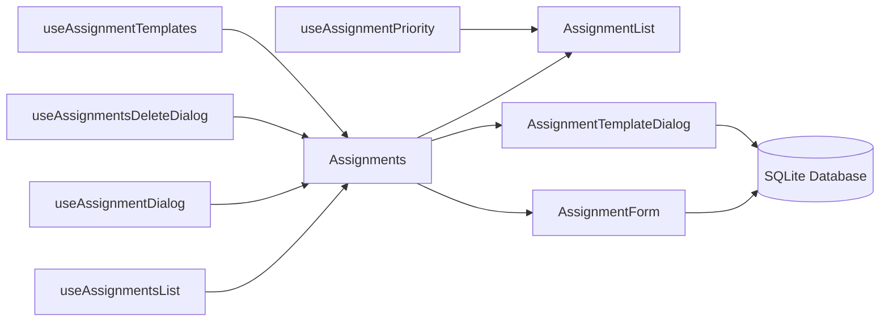

# Academic Organizer Desktop - Development Context

## Project Overview
Academic Organizer Desktop is an Electron + React application for university students to manage courses, assignments, and academic materials. The application uses Material-UI for the UI components and SQLite for data storage.

## Architecture
- **Frontend**: React with Material-UI components
- **Backend**: Electron with SQLite database
- **State Management**: React hooks and component state (potential for Context API/Redux)
- **File Structure**: Component-based organization with shared utilities

## Current Development Focus
- Improving code maintainability through modular architecture
- Keeping files under 300 lines for better readability
- Creating reusable components and custom hooks
- Standardizing data access patterns

## Recent Tasks (Last Updated: March 10, 2025)
1. Refactored CourseDetail component and extracted utility functions
2. Created common components for loading/error states
3. Refactored Dashboard page with custom hooks and smaller components
4. Refactored Courses page following the established pattern
5. Implemented index files for simplified component imports
6. Configured Git LFS for handling large binary files (e.g., build artifacts)
7. Refactored Assignments page components with Material-UI and custom hooks
8. Implemented drag-and-drop assignment prioritization using @dnd-kit/sortable
9. Added assignment templates system for recurring assignment types

## In Progress
- Maintaining component and hook documentation
- Ensuring consistent error handling across the application
- Implementing assignment completion tracking

## Upcoming Tasks
1. Evaluate global state management needs
2. Add comprehensive test coverage
3. Implement file upload functionality
4. Enhance data visualization for assignment completion
5. Add course-assignment relationships
6. Develop backup/restore functionality

## Code Standards
- **Component Structure**: Single responsibility, props documentation
- **Hooks**: Custom hooks for data fetching and complex state
- **Naming**: Descriptive, consistent camelCase for JS/JSX
- **Formatting**: Consistent indentation and spacing
- **Error Handling**: Graceful fallbacks and user-friendly messages

## Current Implementation State (2025-03-10)

### Core Architecture

#### Component Hierarchy
```text
Assignments.jsx (Container)
├─ AssignmentsHeader.jsx
├─ AssignmentList.jsx (with Drag-and-Drop)
├─ AssignmentDetail.jsx
├─ AssignmentForm.jsx (With Validation)
├─ DeleteAssignmentDialog.jsx
├─ AssignmentTemplateList.jsx
└─ AssignmentTemplateDialog.jsx
```

#### Data Flow


### Validation Implementation
```javascript
// AssignmentForm.jsx - Core validation logic
const validateField = (name, value) => {
  switch (name) {
    case 'title':
      return value.trim() ? '' : 'Title is required';
    case 'due_date':
      if (!value) {
        return 'Due date is required';
      } else if (new Date(value) < new Date()) {
        return 'Due date cannot be in the past';
      }
      return '';
    default:
      return '';
  }
};
```

### Database Schema v1.4
```sql
CREATE TABLE IF NOT EXISTS assignments (
  id INTEGER PRIMARY KEY,
  title TEXT NOT NULL CHECK(length(title) <= 100),
  description TEXT,
  due_date DATE NOT NULL,
  status TEXT NOT NULL DEFAULT 'Pending',
  course_id INTEGER,
  priority INTEGER DEFAULT 0,
  created_at DATETIME DEFAULT CURRENT_TIMESTAMP,
  created_from_template INTEGER,
  FOREIGN KEY (course_id) REFERENCES courses(id),
  FOREIGN KEY (created_from_template) REFERENCES assignment_templates(id)
);

CREATE TABLE IF NOT EXISTS assignment_templates (
  id INTEGER PRIMARY KEY,
  name TEXT NOT NULL,
  description TEXT,
  defaults TEXT NOT NULL, -- JSON string of default values
  created_at DATETIME DEFAULT CURRENT_TIMESTAMP
);
```

### Execution Workflow
```bash
# Personal Build Commands
npm start          # Dev mode with hot-reload
electron .         # Direct electron execution
npm run package    # Create portable executable
```

## Personal Runtime Configuration
- **Data Storage**: `%APPDATA%/AcademicOrganizer/data.sqlite`
- **Log Location**: `~/academic_organizer/logs/`
- **Security Settings**:
  - Auto-updates disabled
  - No telemetry/data collection
  - Local storage encryption enabled

## Database Schema
- **courses**: id, name, code, instructor, start_date, end_date, description, color
- **assignments**: id, course_id, title, description, due_date, status, priority, created_from_template
- **assignment_templates**: id, name, description, defaults
- **files**: id, course_id, name, path, size, upload_date
- **notes**: id, course_id, title, content, created_at, updated_at

## Key Dependencies
- React
- Electron
- Material-UI
- SQLite
- React Router
- Date-fns
- @dnd-kit/sortable (for drag-and-drop functionality)

## Development Workflow
1. Plan component/feature changes
2. Implement changes with adherence to code standards
3. Test functionality across the application
4. Document changes and update this context file

## Repository Management
- **Git LFS**: Configured for tracking large binary files (*.exe, *.asar)
- **Ignored Files**: Build artifacts and node_modules are excluded via .gitignore
- **Versioning**: Main development branch is 'main'
- **Clone Requirements**: Team members must have Git LFS installed (`git lfs install`)
- **Post-Clone**: Run `git lfs pull` to fetch binary files after initial clone

## Next Priority Tasks
1. Implement assignment completion tracking
2. Add course-assignment relationships
3. Develop backup/restore functionality
4. Create dark mode toggle
