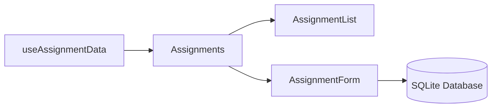

# Academic Organizer Desktop - Development Context

## Project Overview
Academic Organizer Desktop is an Electron + React application for university students to manage courses, assignments, and academic materials. The application uses Material-UI for the UI components and SQLite for data storage.

## Architecture
- **Frontend**: React with Material-UI components
- **Backend**: Electron with SQLite database
- **State Management**: React hooks and component state (potential for Context API/Redux)
- **File Structure**: Component-based organization with shared utilities

## Current Development Focus
- Improving code maintainability through modular architecture
- Keeping files under 300 lines for better readability
- Creating reusable components and custom hooks
- Standardizing data access patterns

## Recent Tasks (Last Updated: March 10, 2025)
1. Refactored CourseDetail component and extracted utility functions
2. Created common components for loading/error states
3. Refactored Dashboard page with custom hooks and smaller components
4. Refactored Courses page following the established pattern
5. Implemented index files for simplified component imports

## In Progress
- Maintaining component and hook documentation
- Ensuring consistent error handling across the application

## Upcoming Tasks
1. Refactor Assignments page components
2. Evaluate global state management needs
3. Add comprehensive test coverage
4. Implement file upload functionality
5. Enhance data visualization for assignment completion

## Code Standards
- **Component Structure**: Single responsibility, props documentation
- **Hooks**: Custom hooks for data fetching and complex state
- **Naming**: Descriptive, consistent camelCase for JS/JSX
- **Formatting**: Consistent indentation and spacing
- **Error Handling**: Graceful fallbacks and user-friendly messages

## Current Implementation State (2025-03-10)

### Core Architecture

#### Component Hierarchy

```text
Assignments.jsx (Container)
├─ AssignmentList.jsx
├─ AssignmentForm.jsx (With Validation)
└─ AssignmentDetail.jsx
```

#### Data Flow



### Validation Implementation

```javascript
// useAssignmentForm.js - Core validation logic
export const validateField = (name, value) => {
  switch (name) {
    case 'title':
      return value.trim() ? '' : 'Title required';
    case 'due_date':
      if (!value) return 'Date required';
      return new Date(value) >= new Date() ? '' : 'Date must be future';
    default:
      return '';
  }
};
```

### Database Schema v1.3

```sql
CREATE TABLE IF NOT EXISTS assignments (
  id INTEGER PRIMARY KEY,
  title TEXT NOT NULL CHECK(length(title) <= 100),
  description TEXT,
  due_date DATE NOT NULL,
  status TEXT NOT NULL DEFAULT 'Pending',
  created_at DATETIME DEFAULT CURRENT_TIMESTAMP
);
```

### Execution Workflow

```bash
# Personal Build Commands
npm start          # Dev mode with hot-reload
electron .         # Direct electron execution
npm run package    # Create portable executable
```

## Personal Runtime Configuration

- **Data Storage**: `%APPDATA%/AcademicOrganizer/data.sqlite`
- **Log Location**: `~/academic_organizer/logs/`
- **Security Settings**:
  - Auto-updates disabled
  - No telemetry/data collection
  - Local storage encryption enabled

## Database Schema
- **courses**: id, name, code, instructor, start_date, end_date, description, color
- **assignments**: id, course_id, title, description, due_date, status, priority
- **files**: id, course_id, name, path, size, upload_date
- **notes**: id, course_id, title, content, created_at, updated_at

## Key Dependencies
- React
- Electron
- Material-UI
- SQLite
- React Router

## Development Workflow
1. Plan component/feature changes
2. Implement changes with adherence to code standards
3. Test functionality across the application
4. Document changes and update this context file

## Next Priority Tasks

1. Implement assignment completion tracking
2. Add course-assignment relationships
3. Develop backup/restore functionality
4. Create dark mode toggle
